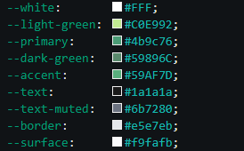

## ZutatenZirkus – Hausaufgabe
**Autorin:** Míriam Domínguez Martínez  
**Datum:** 10.03.2026  
**Kurs:** Full Stack Web Development – DBE Academy  
**Thema:** HTML, CSS & JavaScript – Recipe Website ZutatenZirkus

---

### Projektbeschreibung

Dieses Projekt ist eine interaktive Rezept-Website, ZutatenZirkus, erstellt mit HTML, CSS und JavaScript. Ziel der Aufgabe war es, die grundlegenden Konzepte von JavaScript praktisch anzuwenden: Variablen und Datenstrukturen, DOM-Manipulation, Ereignisverarbeitung (Event Listener) sowie dynamische Berechnung und Darstellung von Rezeptzutaten. Die Website ermöglicht es dem Benutzer, die Portionsmenge anzupassen, woraufhin alle Zutatenmengen automatisch neu berechnet und aktualisiert werden.

---

### Dateistruktur
```
/
├── index.html         
├── style.css         
├── script.js
└── img/
    ├── colors.png
    └── template.png        
└── README.md           
```

---

### Farbpalette



*Entschuldigung dafür, dass ich die Farben der Vorlage nicht eingehalten habe, ich habe einfach mein eigenes Variablen-Template aus meinem Portfolio verwendet, um das CSS schneller erstellen zu können.*

---

*Full Stack Web Development Kurs – DBE Academy, 2026.*
